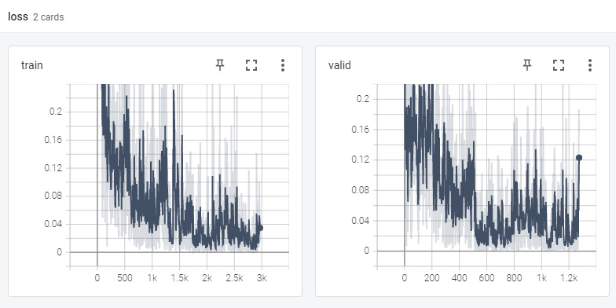

# Plant Disease Classifier

Using a pre-trained efficientnet (`for experimental purposes`) to classifier plant diseases given an image.

The efficient net paper can be found [here](https://arxiv.org/abs/1905.11946) and the pretrained pytorch model got from torch hub 
using ```torch.hub.list('rwightman/gen-efficientnet-pytorch')```

> For more cool PyTorch pre-trained models, check out Ross Wightman [pytorch models repo](https://github.com/rwightman/pytorch-image-models)

Download the dataset from the following link: https://www.crowdai.org/challenges/plantvillage-disease-classification-challenge


# Getting Started

## Dependencies
To set up your python environment to run the code in this repository, follow the instructions below.
1. Create (and activate) a new environment with Python 3.6.
	- __Linux__ or __Mac__: 
	```bash
	conda create --name py39 python=3.9.2
	conda activate py39
	```
alternatively, use virtual environments if you don't have Anaconda installed.

2. Clone the repository (if you haven't already!), and navigate to the `anga` folder.  Then, install several dependencies.
```bash
git clone https://github.com/mrdvince/anga
cd anga
```

## FastAPI endpoint

A minimal API endpoint to expose your model, you can make it more robust if you want.

Run ```uvicorn api.main:app``` and visit you ```local ip``` if running locally port ```8000``` playground to access the interactive docs (included by default). i.e. `http://127.0.0.1:8000/playground`


## Training
See the README on this [link](https://github.com/mrdvince/pytorchtemplate) has been([forked from](https://github.com/victoresque/pytorch-template)). The readme contains information on the folder structures and how to modify the hyperparameters to your liking.

On a high level:
- the config json file contains the model hyperparamaters and other settings

Run `python train.py -c config.json` to train the model.

## Metrics
Logged using tensorboard
### Train and Validation Accuracies 


### Train and Validation Loss 



## Inputs

